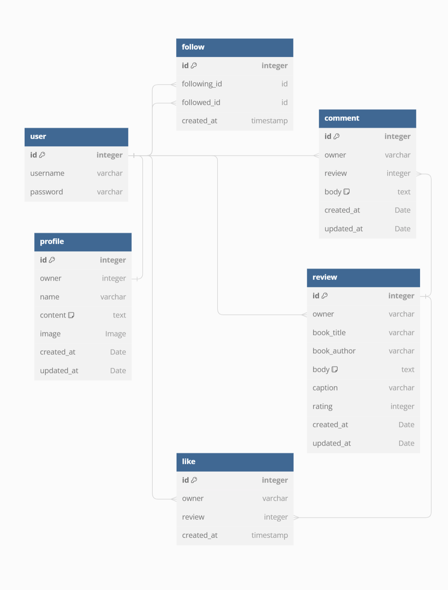

<h1><strong>Project 5 - ReadRave a Book Review Application V2</strong></h1>
 
*Advanced frontend project*  

[View the live site here](https://read-rave-86b7234dccae.herokuapp.com/)

# ReadRave a Book Review Application
A platform and a community for readers that allows you to review books and follow other readers for recommendations.

**PLASE NOTE!:** 
That this app is still in development and contains bugs! Project has been submitted for review with Code Institute and while being reviewed it can't be updated. That being said feel free to look around and test the application in it's current form. 

## Project Goal
### Problem Statement
Following problem statement was created for an imaginary user group:

I am **a user** trying to **find an application where I can share, read and follow conent about the books I like** but **I can't find one** because **other applications aren't specific enough** which makes me feel **like I can't share my passion for books with anyone**.

### Fronted Designer
This project was made to demonstarte advanced frontend skills. This section will explaint the essential parts that front end developer must keep in mind during development.

## Fronted Designer Role
Specialist Front-End developers are a important part of modern software teams, focusing on crafting user interfaces (UI) and optimizing user experiences (UX). They design and implement visually appealing interfaces, ensuring compatibility across different browsers and devices. While collaborating with Back-End developers, aim to integrate Front-End to the Back-End systems. They must stay aware of the user needs and optimize performance for faster loading times. Their expertise is pivotal in delivering engaging, user-friendly web applications.

### Goals
- Goal for this project is to provide a solution for the stated problem statement.
- Build an online platform for sharing revioes on books review for sharing, reading and following book reviews and other readers.
- Allow users to post reviews, read reviews and follow readers alike.
- All visitors to the page should be able to view reviews.
- Registered users should be able to share a review with a photo, review content and review score.
- Registered users should be able to like and comment on reviews.
- Application should be responsive on different screen sizes.
- Application should provide a simple intuitive interface that is easy to navigate.
- Sites layout and colorscheme is pleasing and keeps users coming back to it.

# User Experience UX
## Wireframes
A wireframe for the home page was made using Micorsoft Powerpoint.

## Color Scheme

- Charcoal : Text, borders and details
- Mint Green : Logo, Highlights
- Coral Red : Logo, Highlights
- White : Background and models
- Smoke White/Grey : Background

## Backend Data Design
A design for data was drafted using [diagrams.net](https://app.diagrams.net/).

The data diagram has 5 models user, profile, review, comment and like.

 

## Component Design - React, FrontEnd 
To be updated!

## Agile Stragety
Agile methodologies were applied in the development process of this project. Following principles were kept in mind during he process:
- Development process maintained flexible, so changes could be implemented if it yielded better results.
- Features where kept to minimum, avoiding useless features.
- Features were implemented in order of priority.
- Project was developed in small iterations in order ensure functionality of each feature implemented.
- Github Project board was used as an information radiator to manage feature implementation.
- User Stories were used to design user centric features

## User Stories
User Stories were made using the Github _Issues_ feature. Each issue equated a User Story. Each Issue was tagged with a lable, a Github Issues feature, based on it's importance for the application. Following labels were created (listed in order of importance): 
- Must have
- Should have
- Could have
- Nice to have

Issues were added on the Github Projects Boards, a builtin management tool from GitHub, as tasks. The implementation of the features was tracked by moving the tasks on each of the boards column. Three columns were named: Todo, InProgress and Done.

All together **number** user stories were drafted and Acceptance Criteria together with Tasks were created. View all user stories on the repository issues or on the project board [@P5 Book Review App Kanban](https://github.com/users/HMuraja/projects/5/views/1).

### BACKEND
Following **9** user stories were implemented during the development of the backedn API.

| Title                     | Story                                                                                                                                        | Priority               | Implemented |
| ------------------------- | -------------------------------------------------------------------------------------------------------------------------------------------- | ------------------- | ----------- |
| Profile Model | As a **user/viewer** As a **user** I can **view, edit and delete my profile** so that **I can personalize my account and view my data** | Must Have | No |
| Review Model | As a **user** I can **create, edit and delete review** so that **I can share a review on books l have read** | Must Have | No          |
| Comment Model | As a **user** I can **easily create a comment and edit/delete it if i want to ** so that **I discuss of any reviews I am interested of**| Must Have | No  |
| View Comment Instance | As a **viewer** I can **easily see comments other have made to the review** so that **I can see what other people though about the review**| Should Have | No          |
| Like Model | As a **user** I can **boost the reviews I think are good** so that **I can have an impact on the quality of the reviews posted**| Should Have | No          |
| Like Feed | As a **user** I can **view the reviews I liked** so that **I can find easily any reviews that I liked** | Should Have | No          |
| Follow Model | As a **user** I can **follow users that I like** so that **I modify my personal feed to include reviews from users I like** | Could Have | No          |
| Authentication - Backend | As a **user** I can **easily login and logout** so that **I can access the content and be recognized as a logged in user by the application**.| Could Have | No          |
| Profile Summary - Backend | As a **user/viewer** I can **view anyone's profile details** so that **I can see a summary of their interactions and activity**. | Could Have | No          |

### FRONEND
Following **number** user stories were implemented during the development of the fronend interface.
**To be updated!** Please see the [project issues](https://github.com/HMuraja/p5-book-review/issues) for the relevant userstories with the **frontend tag**.

| Title                     | Story                                                                                                                                        | Priority               | Implemented |
| ------------------------- | -------------------------------------------------------------------------------------------------------------------------------------------- | ------------------- | ----------- |
|  | |  |   |

# Features

## Landing Page
The home page or landing displays all the shared review cards. All reviews are displayed one after each other and 10 reviews are downloaded at the time, and if user scrolls down more reviews are displayed. Each review card displays an image of the reviewer, book/a placeholder, book title, and caption for the review. 

On the right hand side(desktop) or on the top of post(mobile) 5 most popular profiles are displayed.

On the top of the posts you have a search bar enabling you to search reviews based on the title or author.

## Header/Navigation Menu
App icon and the navigation items are placed on the top of the application. The navigation menu items are links to home, feed, profile and signup pages. Navigatio options available for the viewer are login, signup and home. Icon works as a link to home page. 
 
On Medium sized screens and smaller the menu collapses into a dropdown menu.
 
## Review Page
If the user clicks on the book image, they are lead on to the review's page where user can read the review and view comments. 

If the logged in user is the owner of the review, a three dot icon appears and allows user to edit or delete the review.

On the bottom of the body the date of creation is detailed and the comment section starts. If user isn't logged in they may only view the the recipe details and any comments that other users have left.

Any users logged can use a leave a comment form to leave a comment and edit or delete any comments left.

## Like
If the user wants to like a review they have to log in and navigate to the review they like. On the review card they must click on the heart icon, in order to like it or unlike it. The page will refresh and the number of likes will be updated and the heart icon will change depending on if the user liked (solid colored heart icon) or unliked (outlined icon). 

## Login

If the user has already signed up and are logged out from their account they can press *Login* button on the navigation menu and a login window will open up.

User needs to enter username and their password and click login. The login form will be validated and an error message will display if the login isn't succesful.

Also, the navigation menu won't have items *Sign Up* or *Login* instead there are *Logout* and *Add Review* instead. 

## Signup

If the user wan't to carry out any other functionalities on the site other than viewing data, they must create a account to do that. They can do it by clicking on the signup button on the navigation menu. This opens a signup form that the new user must fill.

## Logout

Once logged in simply click log out from the top of the navbar.

## Add Reviw

If user wants to create a recipe they must click on the button at the navigation menu or the navigation link stating *Add Review*.

Clicking the link or the button should open the page with the "Add a Review"-form. All the fields, title, author, caption, content and score, are mandatory. If the user won't select an image it will be replaced with a placeholder image.

A succesful submission will take the user to the review page.

## Edit Review
Logged in review owner has the option to edit review on the review detail page. 

## Delete Review
Logged in review owner has the option to delete review on the review detail page.

# Technologies
## Languages
HTML5 - Used on templates to build the structure of the sites and render an iterface.
CSS3 - Used to add design to the html structure for more pleasing interface.
Python - Used as the backend language.
JavaScript - Used as the frontend language.

## Frameworks and Libraries
Versions for all the libraries can be seen in the requirements.txt.

### Backend
- asgiref: ASGI stands for Asynchronous Server Gateway Interface, which is a standard for Python - - - ----- asynchronous web servers and applications.
- cloudinary: A cloud-based image and video storage service with features like uploading, optimization, and delivery.
- dj-database-url: A utility for Django projects to utilize database configuration via URLs.
- dj-rest-auth: Provides authentication features for Django REST framework.
- Django: A high-level Python web framework that encourages rapid development and clean, pragmatic design.
- django-allauth: Authentication app for Django that handles various authentication methods.
- django-cloudinary-storage: A storage backend for Django to use Cloudinary for file storage.
- django-cors-headers: A Django application for handling the server headers required for Cross-Origin - - - Resource Sharing (CORS).
- django-filter: A Django application for allowing users to filter queryset dynamically.
- djangorestframework: A powerful and flexible toolkit for building Web APIs in Django.
- djangorestframework-simplejwt: Provides a JSON Web Token authentication backend for Django REST framework.
- gunicorn: A Python WSGI HTTP server for deploying web applications.
- oauthlib: A generic, spec-compliant, thorough implementation of the OAuth request-signing logic.
- Pillow: A Python Imaging Library (PIL) fork for opening, manipulating, and saving image files.
- psycopg2: PostgreSQL adapter for Python.
- PyJWT: JSON Web Token implementation in Python.
- python3-openid: A set of Python packages to support use of the OpenID decentralized identity system.
- pytz: World timezone definitions, modern and historical.
- requests-oauthlib: OAuthlib support for Python requests.
- sqlparse: A non-validating SQL parser module for Python.
- urllib3: A powerful HTTP client for Python, which provides a simple interface for making HTTP requests.
- whitenoise: Radically simplified static file serving for Python web apps.

## Software and Web Applications Used
Following applications were used to make this project:

- App Diagrams - An application used to create database diagrams to visualize the data structure.
- Cloudinary - A cloud-based storage for static files, used to store project images.
- Coolors -  Used to generate image of the color scheme.
- ElephantSQL - A PostgreSQL database hosting service used to store data in this process.
- FontAwesome - Used to generate icons for the project.
- GitHub - An online repository and version control. Also used as the project management tool.
- GitPod - An online code editor used during this process.
- Google Chrome Dev Tools - A tool provided by Chrome browser, used to troubleshoot and test responsiveness of the application.
- Google Fonts - A free online library of fonts. Used for applying suitable fonts for the project.
- Heroku - A cloud platform that is used to deploy the applications.
- Figma - Used for creating the site wireframes.

# Tests
To be done in the future.

## Tests on user stories
Site **WILL BE** tested to confirm the acceptance criteria and tasks on the User Stories were full-filled. 

### USER STORY: Profile Summary - Backend
Please refer to the [issues](https://github.com/HMuraja/p5-book-review/issues) of this repository to see all the Backend labelled UserStories. After testing the backend all userstories were fullfilled and acceptance criteria approved. 

### USER STORY: Profile Summary - Frontend
Please refer to the [issues](https://github.com/HMuraja/p5-book-review/issues) of this repository to see all the Feontedn labelled UserStories. Frontedn has not been fully tested and therefore userstories have not been completed on their end yet. 

This section will be completed later on.

# Deployment
## API Deployment
Once API was built it was deployed in Heroku. 
1. Propr to deploying the JWT tokens were installed, so they could be used process environment. 'dj_rest_auth" was installed to enable user registration.

2. The rr_api settings were changed so that database for process environment would be ElephantSQL. ElephantSQL account was created and the URL added to the env.py. 

3. The env.py data was updated to look as follows:

        import os
        os.environ['CLOUDINARY_URL'] = ('cloudinary:/...')
        os.environ['ALLOWED_HOST'] = ('https://read-rave-86b7234dccae.herokuapp.com')
        os.environ['SECRET_KEY'] = ('django-insecure-...')
        os.environ['DATABASE_URL'] = ('postgres://...')

4. In Heroku a new app called 'read-rave' was created. In *settings* of the created app Config Vars key value pairs were set to be as displayed below:
        
        KEY: ALLOWED_HOST           VALUE: https://read-rave-86b7234dccae.herokuapp.com/
        KEY: CLOUDINARY_URL         VALUE: cloudinary:/...
        KEY: DATABASE_URL           VALUE: postgres://...
        KEY: DISABLE_COLLECTSATIC   VALUE: 1
        KEY: SECRET_KEY             VALUE: django-insecure-...

5. In *Deploy* tab of the app *Deployement* method was selected to be GitHUb.
6. *App connected to GitHub* was selected to the the *p5-book-review*.
7. On *Manual Deploy* Deploye Branch was clicked to deploye the API.

## Second Deployment
Second deployment was done after frontedn react folder was added to the API repository. 

This section will be completed in more detail later on. 

# Credits
Following resources were used to help build this project:
- SVG icons were obtained from [Font Awesome](https://fontawesome.com/)
- Book reviews and reviews content were taken from [Amazon](https://www.amazon.co.uk/)
- Placeholder image, cover photo and profile image was taken from [Pexels](https://www.pexels.com/)
- Code Institutes walk through process "Moments" was used as an inspiration for this project.
- [Django Docs](https://docs.djangoproject.com/en/4.2/) were used through out the process to solve issues and used for guidance.
- [React Bootsrap Docs]([https://getbootstrap.com/docs/5.3/getting-started/introduction/](https://react-bootstrap-v4.netlify.app/)) were used through out the process to solve issues and used for guidance.
- [React Docs](https://legacy.reactjs.org/) were used through out the process to solve issues and used for guidance.

